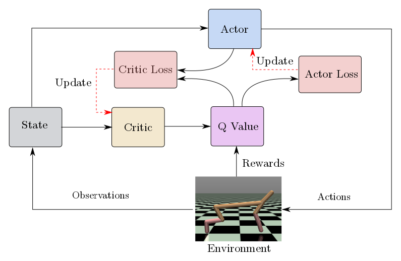

# Implementation
# Soloplay 
# Problem with stabiliity
# Models

* Update Critic
  * Get predicted next-state actions and Q values from target models
  * Compute Q targets for current states (y_i)
  * Compute critic loss
  * Minimize the loss
* Update Critic
  * Compute actor loss
  * Minimize the loss
* Update target networks 
# Training
# Analyis
# Tournament
