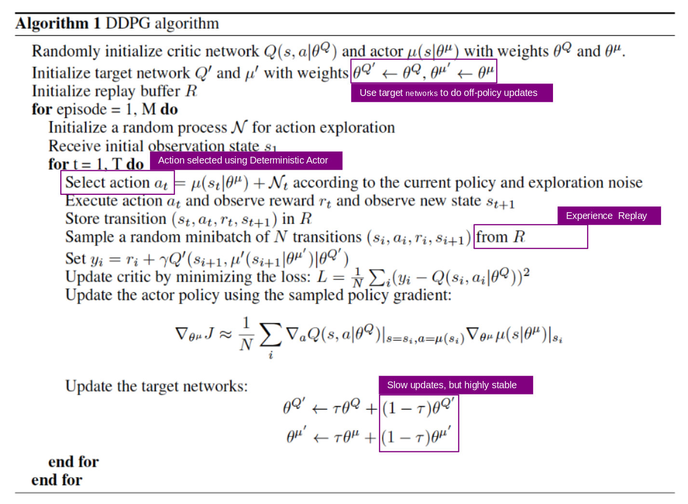
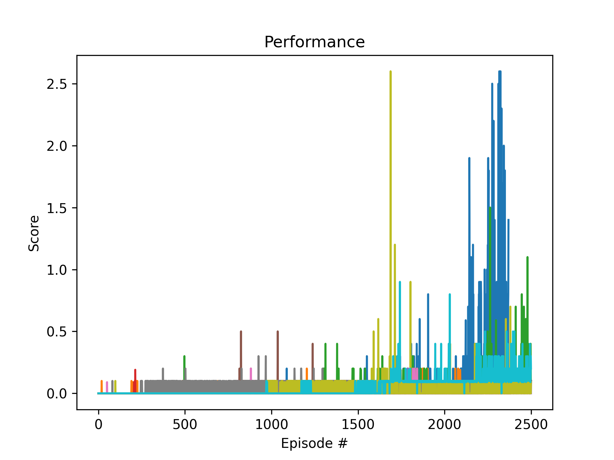

# Implementation
 algorithm already available for project P2. [Continuous Control)(https://github.com/SusannaMaria/DRLND_P2_ContinuousControl/blob/master/Report.md)

My Agent implementation: [agent.py](agent.py). 
It was very helpful to study https://towardsdatascience.com/deep-deterministic-policy-gradients-explained-2d94655a9b7b

* Update Critic
  * Get predicted next-state actions and Q values from target models
  * Compute Q targets for current states (y_i)
  * Compute critic loss
  * Minimize the loss
* Update Critic
  * Compute actor loss
  * Minimize the loss
* Update target networks 

## Characteristics
**Target network**: Using two deep networks θ- and θ for actor. Using the first one to retrieve Q values while the second one includes all updates in the training. After some updates, we synchronize θ- with θ. The purpose is to fix the Q-value targets temporarily so we don’t have a moving target to chase. In addition, parameter changes do not impact θ- immediately and therefore even the input may not be 100% iid (Independent and identically distributed random variables)

**Experience replay**: Put the transitions into a buffer and take a sample from a mini-batch of 128-size samples from this buffer to train the deep network. This forms an input data set that is more stable for training. As the randomly sample of the playback buffer, the data is more independent of each other and closer to the iid (independent and identically distributed).

**Ornstein-Uhlenbeck process** The Ornstein-Uhlenbeck Process generates noise that is correlated with the previous noise, as to prevent the noise from canceling out or *freezing* the overall dynamics <cite>https://www.quora.com/Why-do-we-use-the-Ornstein-Uhlenbeck-Process-in-the-exploration-of-DDPG/answer/Edouard-Leurent?ch=10&share=4b79f94f&srid=udNQP</cite>

)
## Multi Agent Approach with DDPG 
Initially I used two independent DDPG agents to solve the tennis problem. After many failures with very low rewards over more than 2000 episodes, I got the advice to use one instance of a DDPG agent for both sides to teach themselves to play tennis on their own. The agent could be trained successfully with this approach but showed great instabilities and basically every training with different hyper parameters led to similar results and the agent collapsed to zero after a very good reward.

A typical behavior of the training. It shows no increase in the reward over a long period of time and then rises explosively and then collapses again soon. It was interesting that different results were achieved with the same hyperparameter definitions.

# Solving the problem with stabiliity ... or not

# Models
# Training
# Analyis
# Tournament
