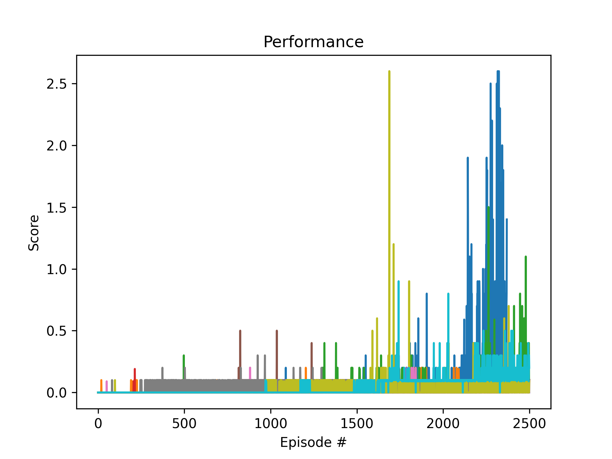
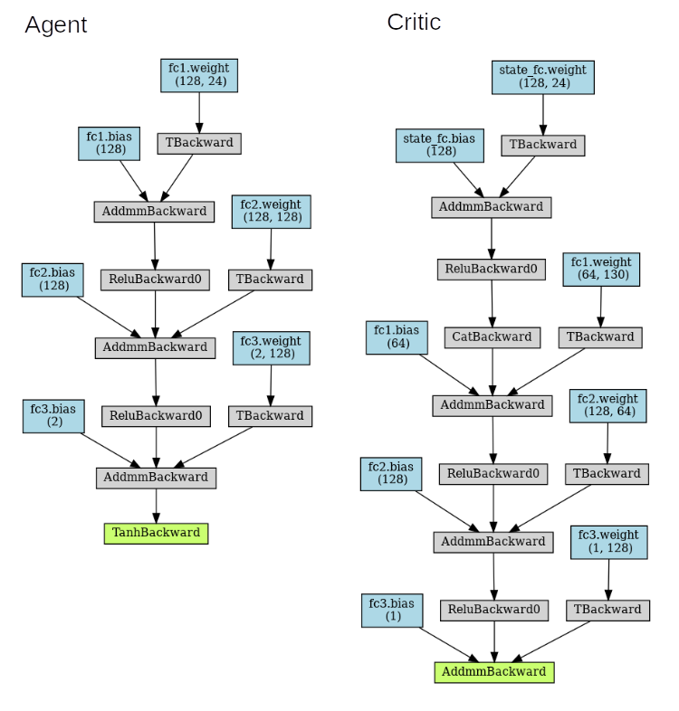
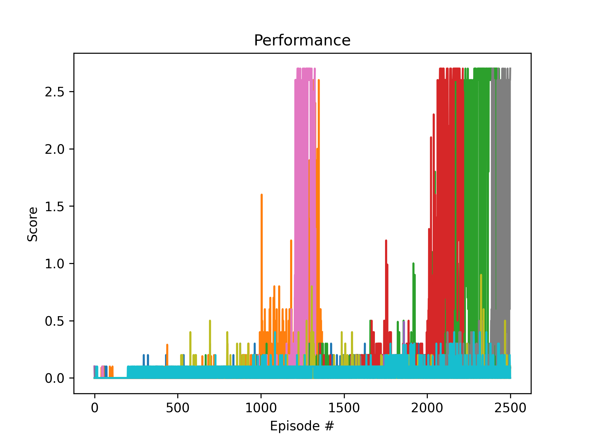
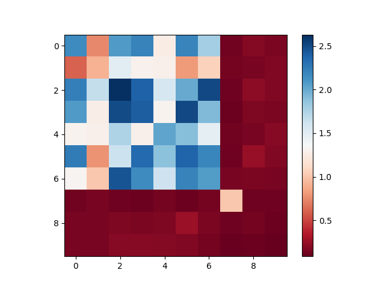

# Implementation
After the benchmark description, I decided to use the DDPG (Deep Deterministic Policy Gradient) algorithm (Two agents who played together but trained independently). After a number of failed trainings over 1500 episodes, I decided on an approach where one agent should play both sides simultaneously during training.  https://github.com/udacity/deep-reinforcement-learning/blob/master/ddpg-pendulum/ddpg_agent.py and https://github.com/qiaochen/DDPG_MultiAgent -related to the integration of a solo agent into the tennis environment.

# Base Agent: DDPG 
Paper: https://arxiv.org/pdf/1509.02971.pdf 

To solve the problem I used the implementation of the Deep Deterministic Policy Gradient (DDPG) algorithm already available for project P2. [Continuous Control)(https://github.com/SusannaMaria/DRLND_P2_ContinuousControl/blob/master/Report.md)

My Agent implementation: [agent.py](agent.py). 
It was very helpful to study https://towardsdatascience.com/deep-deterministic-policy-gradients-explained-2d94655a9b7b


## Characteristics
**Target network**: Using two deep networks θ- and θ for actor. Using the first one to retrieve Q values while the second one includes all updates in the training. After some updates, we synchronize θ- with θ. The purpose is to fix the Q-value targets temporarily so we don’t have a moving target to chase. In addition, parameter changes do not impact θ- immediately and therefore even the input may not be 100% iid (Independent and identically distributed random variables)

**Experience replay**: Put the transitions into a buffer and take a sample from a mini-batch of 128-size samples from this buffer to train the deep network. This forms an input data set that is more stable for training. As the randomly sample of the playback buffer, the data is more independent of each other and closer to the iid (independent and identically distributed).

**Ornstein-Uhlenbeck process** The Ornstein-Uhlenbeck Process generates noise that is correlated with the previous noise, as to prevent the noise from canceling out or *freezing* the overall dynamics <cite>https://www.quora.com/Why-do-we-use-the-Ornstein-Uhlenbeck-Process-in-the-exploration-of-DDPG/answer/Edouard-Leurent?ch=10&share=4b79f94f&srid=udNQP</cite>

## Multi Agent Approach with DDPG 
Initially I used two independent DDPG agents to solve the tennis problem. After many failures with very low rewards over more than 2000 episodes, I got the advice to use one instance of a DDPG agent for both sides to teach themselves to play tennis on their own. The agent could be trained successfully with this approach but showed great instabilities and basically every training with different hyper parameters led to similar results and the agent collapsed to zero after a very good reward.
### Soloplay DDPG
A DDPG agent plays both sides during the training of the tennis game and thus learns to play both sides. Since the environment rewards cooperative play (keeping the ball in the air for a long time) this seemed like a worthwhile approach.

The chosen approach of the solo play of a DDPG is by far not perfect but I could train the agent to handle the task.

A typical behavior of the training. It shows no increase in the reward over a long period of time and then rises explosively and then collapses again soon. It was interesting that different results were achieved with the same hyperparameter definitions.



### Solving the problem with stabiliity ... or not
The behaviour during the training of the tennis game was sometimes sobering but very instructive. I take for myself that DRL is a first hopeful glimmer of a possible General AI.  The fact that an optimum could be achieved by repeated training and adjustments of the hyper parameters showed the necessity to deal with how to train and to reproduce the results.

**hints**
* Prepare your environment so that you can control hyper parameters from outside with scripting and batch programs.
* Repeat trainings even if first the parameters show terrible results
* Buy a fast machine and a halfway decent GPU (which I did) if you want to take DRL seriously for yourself ... take a linux operating system 
* Try to become better in python

# Models
Model parameters like dimensions were taken from https://github.com/udacity/deep-reinforcement-learning/blob/master/ddpg-pendulum/model.py and showed a good performance. I have created an export of the networks via https://github.com/szagoruyko/pytorchviz


# Training
Since the training was very unstable, the model weights were stored continuously and if the agent could be trained above 0.5, a fallback to the last best state was implemented.

Parameters that have not been changed over the training period

| Hyperparameter   | general  |
|:-----------------|---------:|
| epsilon          |    1     |
| epsilon_decay    |    0.995 |
| gamma            |    0.95  |
| lr_decay         |    0.995 |
| main_n_loop      |   10     |
| num_episodes     | 2500     |
| random_seed      |  999     |
| replay_buff_size |    1e+06 |
| soft_update_tau  |    0.001 |
| test_n_run       |  100     |

Parameters that have been changed. A total of 10 runs were made

|                    |          0 |          0 |          0 |         0 |          0 |          0 |          0 |          0 |           0 |           0 |
|:-------------------|-----------:|-----------:|-----------:|----------:|-----------:|-----------:|-----------:|-----------:|------------:|------------:|
| actor_layer_dim_1  |  64        |  64        |  64        |  64       |  64        |  64        |  64        |  64        |  64         |  64         |
| actor_layer_dim_2  | 128        | 128        | 128        | 128       | 128        | 128        | 128        | 128        | 128         | 128         |
| actor_layer_dim_3  |   0        |   0        |   0        |   0       |  64        |  64        |  64        | 128        | 128         |   0         |
| batch_size         |  64        | 128        |  64        | 128       |  64        | 128        | 256        |  64        |  64         |  64         |
| critic_layer_dim_1 |  64        |  64        |  64        |  64       |  64        |  64        |  64        |  64        |  64         |  64         |
| critic_layer_dim_2 | 128        | 128        | 128        | 128       | 128        | 128        | 128        | 128        | 128         | 128         |
| critic_layer_dim_3 |   0        |   0        |   0        |   0       |   0        |   0        |   0        |   0        |   0         |  64         |
| lr_actor           |   1e-05    |   1e-05    |   0.0001   |   0.0001  |   0.0001   |   0.0001   |   0.0001   |   0.0001   |   1e-05     |   0.0001    |
| lr_critic          |   0.0001   |   0.0001   |   0.0001   |   0.0001  |   0.0001   |   0.0001   |   0.0001   |   0.0001   |   0.0001    |   1e-05     |
| scores_min         |   0        |   0.0403   |   0.0194   |   0       |   0        |   0        |   0        |   0        |   0.002     |   0.0167    |
| scores_max         |   1.9529   |   0.8662   |   2.601    |   2.331   |   2.15     |   2.3709   |   2.27     |   1.1311   |   0.1561    |   0.09      |
| scores_mean        |   0.34578  |   0.17942  |   0.78306  |   0.49189 |   0.40662  |   0.52985  |   0.8188   |   0.20758  |   0.07861   |   0.05296   |
| scores_std         |   0.592145 |   0.237737 |   0.856658 |   0.79874 |   0.683908 |   0.702423 |   0.886559 |   0.331744 |   0.0412998 |   0.0309718 |

# Analyis
I trained a total of ```10 hyperparameter variants * 10 trainings * 2500 episodes = 250000 episodes``` for 100 model checkpoints over 1 day on my PC. The results of a training could go against zero or an ideal reward greater than 2, so I decided to train each hyperparameter set 10 times. The score shown in the table (Min, Max, Mean, Std) was calculated from 10 independent checkpoints per hyperparameter data set. Each of them played 100 episodes solo with himself.

## Which dataset is the best?
For each parameter set I saved the checkpoints for 10 complete trainings with 2500 episodes each. I saved the results of the training scores and the test runs into a JSONfile e.g. [project.json](chkpts/03Run/project.json)

* Small batchsize of 64, the higher the worse
* Learnrate Actor and Critic set to 0.0001
* Dimensions for hidden layers of Actor and Critic 64x128

Even with optimal parameters, several new (with 2500) episodes had to be trained. 



# Tournament
I wanted to see how a solo player performs in a competition with others and let every best trained agent for each hyperparameter set play with himself and against each other from different dataset




The top 5 of the games. Solo game 3 won. Hyperparameter set 4 and 6 together had the best score in the mixed game.

```
03Run/03_best_model.checkpoint vs. 03Run/03_best_model.checkpoint = 2.631000039204955
04Run/09_best_model.checkpoint vs. 06Run/04_best_model.checkpoint = 2.5099000374041496
03Run/03_best_model.checkpoint vs. 07Run/09_best_model.checkpoint = 2.502000037282705
04Run/09_best_model.checkpoint vs. 03Run/03_best_model.checkpoint = 2.4930000371485947
07Run/09_best_model.checkpoint vs. 03Run/03_best_model.checkpoint = 2.4568000366166234
```

# Ideas for Future Work
* Optimize the code so that more like two agents can play together, for example Soccer
* See if TD3 gives better results than DDPG.
* Optimize the saving and loading of models and the respective project configuration
* Examine this solution with other UnityML Agent environments